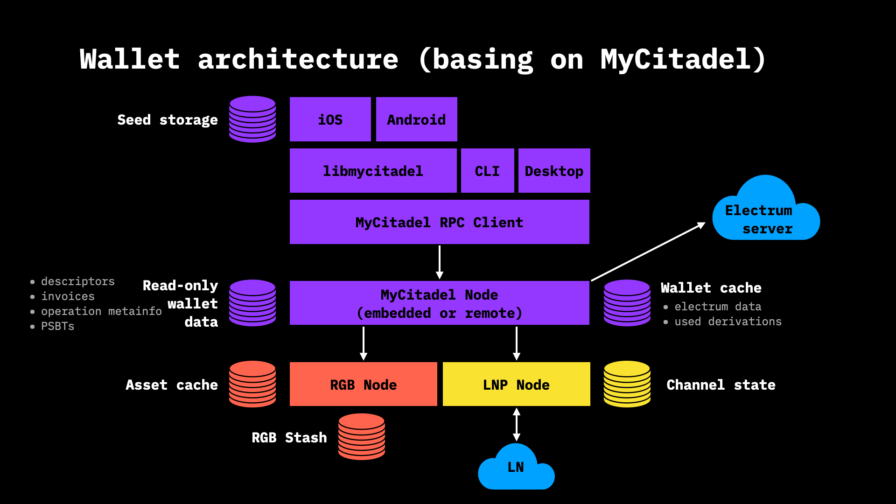
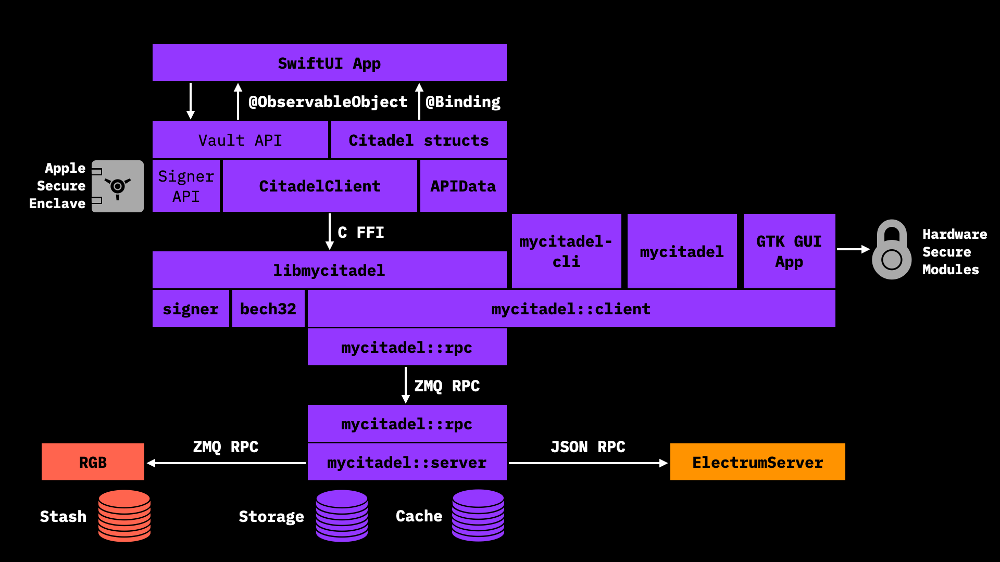
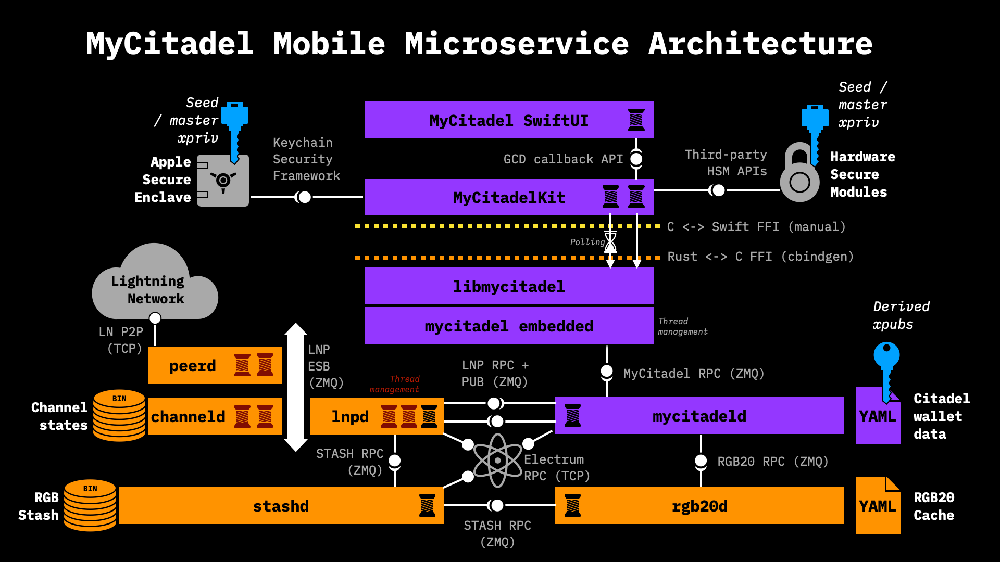

# Citadel: Bitcoin, LN & RGB wallet runtime and client library

Node operating MyCitadel wallet (can be embedded, self- or cloud-hosted) 
providing synchronization between bitcoin blockchain, lightning node (LNP Node)
and RGB assets stash state (RGB Node). It supports
- Arbitrary-complex descriptor-based wallets
- Miniscript-based wallet spending policies
- Complex multisignature schemes
- Lightning network (in generalized format, with planned support for
  multi-peer channels, DEX etc)
- [RGB assets](https://www.rgbfaq.com/faq/untitled)
- [Universal invoices](https://github.com/LNP-BP/FAQ/blob/master/Presentation%20slides/Universal%20LNP-BP%20invoices.pdf), 
  supporting on-chain descriptor- and PSBT-based invoices, Lightning network,
  RGB assets, repeated payments, multiple beneficiaries etc...
- Taproot & Schnorr signatures (WIP)
- Partially signed bitcoin transactions
- Arbitrary complex derivation paths, including new identity-based
  derivations for multisigs and taproot 
  (see https://lists.linuxfoundation.org/pipermail/bitcoin-dev/2021-February/018381.html)
- Complete separation of private keys to external HSMs or multiple signature
  servers etc (via PSBTs)

MyCitadel Node demonstrates how modern censorship-resistant self-sovereign 
privacy-focusing P2P software can be developed basing on
[LNP/BP Association](https://github.com/LNP-BP) standards, frameworks and
libraries for LNP/BP & Internet2 protocols.
  
This repository can run (in embedded mode) or connect to external 
[RGB Node](https://github.com/rgb-org/rgb-node) and 
[LNP Node](https://github.com/LNP-BP/lnp-node), plus it require
external Electrum Server accessed via ElectrumX protocol (in future will be
replaced by [BP Node](https://github.com/LNP-BP/bp-node)).

MyCitadel Node is based on:
- [Descriptor wallet](https://github.com/LNP-BP/descriptor-wallet) native rust
  bitcoin wallet library
- [Internet2 suite of protocols](https://github.com/internet2-org/rust-internet2) 
- [Web4 microservice framework](https://crates.io/crates/microservices) from 
  the same repo

MyCitadel node can be either run as a daemon or as an embedded library. It can 
be accessed using command-line tools, shipped as a part of this repository:
- `mycitadel-cli`, for connecting to a standalone `mycitadeld` daemon run in 
  background/in the cloud
- `mycitadel`, which contains embedded node and does not require any daemon

or from platform-specific GUI applications, which support both embedded and
external node operation mode:
- Native [iOS, iPadOS, macOS](https://github.com/mycitadel/mycitadel-swiftui)
  created with SwiftUI
- Native Android (planned)
- Cross-platform desktop (Linux, macOS, Windows) – GTK+-based (planned)

MyCitadel node ships with C library (`libmycitadel`) providing FFI which 
can be used from other languages (it is currently used by native mobile
MyCitadel wallets, but also can be interfaced from NodeJS, React Native, 
Python, Go and other runtimes and languages). It also includes native
Swift class library (`MyCitadelKit`) which simplifies interaction with the
node for Apple mobile & desktop applications (similar Java class library is
planned for Android & JRE).

## Design & architecture

High-level architecture:

More details on modules:

Microservice architecture

